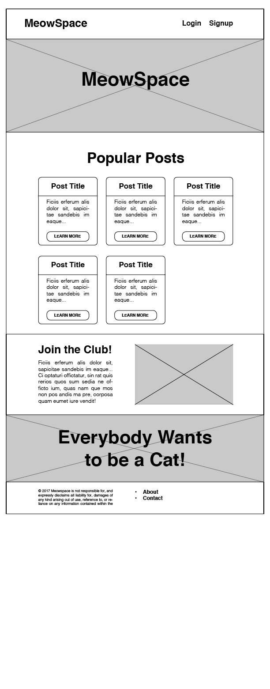

# Meowspace

This is an individual, [stage 2](https://github.com/Ada-Developers-Academy/pedagogy/blob/master/rule-of-three.md) project.

## Learning Goals
- Practice Layout Techniques
- Have DRY, readable CSS code using CSS selectors with classes and ids
- Add Custom Styling

## Baseline
Using CSS, construct the layout of the site according to the drawing below.

This drawing is called a wireframe. Wireframes are like a blueprint for your site's layout design. It highlights the layout without focusing on any of the design specifics (like color, fonts etc.). The areas that have an giant 'x' crossed through it are meant to represent the areas that have an image. **Hint:** There are two sections in this wireframe that have images as backgrounds.

**You can make only make limited changes to the HTML**
  - You cannot move any content around in the HTML
  - You can add sectioning elements to wrap around content
  - You can add ID's and classes to elements, as necessary

## Primary Requirements

- Add normalize.css
  - Normalize is a popular collection of CSS rulesets used to render elements more consistently across browsers.
  - Go to [https://necolas.github.io/normalize.css/](https://necolas.github.io/normalize.css/), click the red download button, copy and paste the code into a new file called 'normalize.css' and link to it as you would with main.css. The link to normalize.css should come before your main.css.
- Use CSS to rearrange the layout to match the drawing as much as possible (it doesn't need to be perfect). You should utilize the following layout techniques at least once:
  - Inline Block display
  - Floats
  - Fixed Positioning (With the top header)
- Add custom styling
  - At least one google font
  - At least one pseudo selector (like hover)
  - Background color on one section
-  Identify repeated styles and use CSS selectors and class/id names to organize and DRY your code.

### Optional Enhancements

- Add [parallax scrolling](https://www.w3schools.com/howto/howto_css_parallax.asp) to the hero banner
- Animate the h1 element to fade in on page load
- Create a new page for one of the articles
  - Create a wireframe for the layout design
  - Create the content and structure with HTML, in new HTML page
  - Style the new HTML page to match your wireframe
